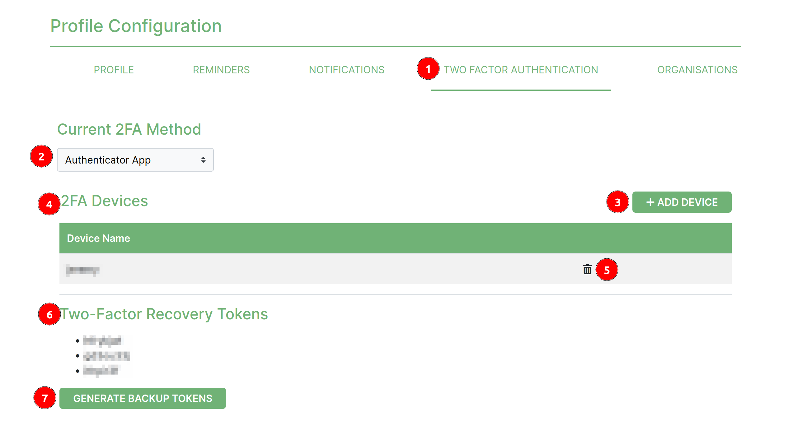

# Two Factor Authentication Settings

The Two-Factor Authentication (2FA) page handles the user's 2FA settings, which add an extra layer of security to their account. 2FA requires users to provide two different authentication factors to log in, typically something they know (like a password) and something they have (like a device or token). This page allows users to manage their 2FA settings These include:

* Backup tokens
* Two factor authentication devices

## Two Factor Authentication Tab

1. **Two Factor Authentication Tab**: This is part of the profile page, where a user will find the settings.
2. **Current 2FA Method**: Shows the current 2fa method the user uses to log on to the platform.
3. **Add Device**: Clicking this button will evoke a popup modal requiring the user to enter the new device details before saving it as part of their 2FA setup.
4. **2FA Devices**: This is the table that shows the current 2FA devices the user uses to log on to the platform.
5. **Delete Icon**: Clicking this will open a popup modal to confirm whether the user wants to remove the device before proceeding.
6. **Recovery Options**: Under this header, lists the backup tokens the user can use to log on to the platform in case in case they have lost their primary device or are unable to use it.
7. **Generate Backup Token**: The user has the ability to refresh their backup tokens as well as create new ones when they've just registered onto the platform.

### Add device popup modal

1. **Device Name**: A label indicating the value that is required in the field below it.
2. **Add button**: When clicked will save the new device and return a QR Code Image.

1. **QR Image Code**: A label indicating the success result when the device is added.
2. **QR Code**: The user should scan this QR code with the authenticator app of their choice on their new device.

### Delete device modal

1. **Cancel**: Clicking this option will prevent the device from being removed. This is in case the user isn't sure or clicked the icon by accident.
2. **Delete button**: Clicking this button will remove the device from the platform therefore the user will no longer be able to login using that device.
